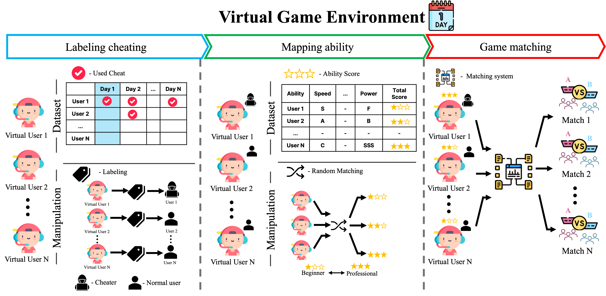

# Vega



This repository contains the information about Vega. Before you explore the Vega, we recommend visiting [the Gynopticon first](https://github.com/gangjeuk/Gynopticon).

Vega is Virtual environment for simulating game anti-cheat policies.

You can test anti-cheat policies by applying various anti-cheat method on it.

# Package dependency and Code explanation for policy testing

## Dependencies

Please use Python3.10, since our experiments and previous studies we inferred in our paper are using 3.10 version.

The requirements can be installed with following command

```
$ pip install -r requirements.txt
```

We strongly recommend to use virtual environment.

## Code and policy setting

You can apply your cheating detection system and your own policies on various game by modify codes in `main.py`.

There are two critical types of functions in `main.py`.

The two types are `simulate_[genre]` and `[genre]_policy`. 

First of all, `simulate_` function is for simulating maches during a day. You can set your own variables which you implemented for your own detection method. In our case, we applied **Validity** and **Dubious** scores as we did in the paper.

```
def simulate_[genre](begin_date, end_date, user, ...):
    ...
    # Set variables for simulation
    user['dub'] = .0
    user['val'] = .0   
```
After that you can test your policies and detection method in `_policy` function.

Vega provides all virtual-user-pool and matching data in `_policy` function. Virtual users already labelled with the cheating usage and team drafts after match-making are also provided.

Using the varaibles set before, you can test your policies.

```
def [genre]_policy(user, team_draft, ...):
    ...
    # User-pools
    benign_user = user.loc[(user.index.isin(team_draft) & user.used_bot.eq(False))]
    cheater_user = user.loc[(user.index.isin(team_draft) & user.used_bot.eq(True))]    
    # Policy code
```


# Reproducing the results

## Assumption

Before you test your cheating detection method and your own policies on Vega, you have to know about our cheating detection system, [Gynopticon](https://github.com/gangjeuk/Gynopticon).

Since, experiments using Vega are based on the results of Gynopticon, so follow the instructions in the repository before testing.

## Reproduce the results.
You can reproduce the results of experiemtns with following commands.

```
# N vs N games
$ python3 eval/moba.py

# 1 vs 1 games
$ python3 eval/action.py
```

If you want to conduct experiments on different condition, you have to change a seed number. For that you have to edit seed numbers in `/utils/__init__.py`, `/res/Gynopticon`. The files contain seed numbers for *Vega (this project)*, *Gynopticon (our cheating detection system)* each.

## Figures

If you want to generate figures for the results of experiments, you can simply reproduce it with following command.

```
$ python3 plot.py
```

# Citation
WIP